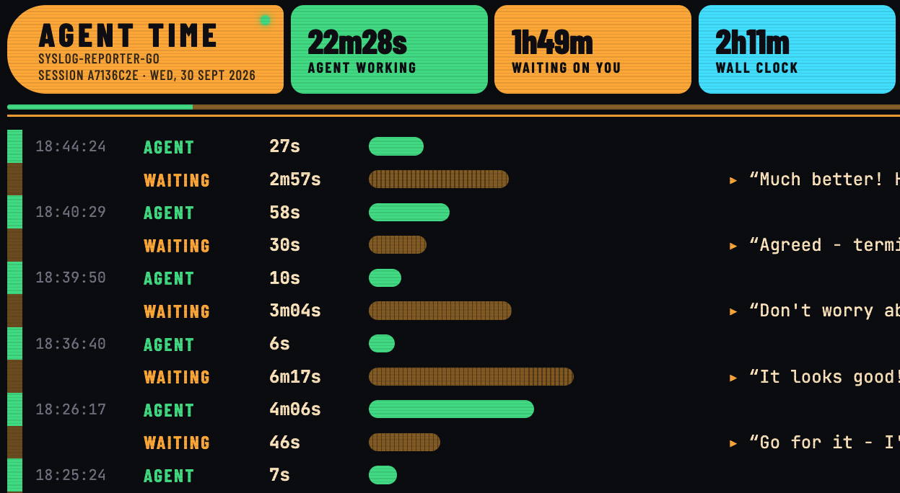

# agent-time-tracker

Shows how much of a Claude Code or Codex session the agent spent working, and how much it spent waiting on you.



## What it does

`att` reads the session logs Claude Code keeps under `~/.claude/projects/`, or Codex keeps under `~/.codex/sessions/`, and splits each session into stretches of agent work and stretches of waiting on the you.

If the project and agent uses [`ait`](https://github.com/ohnotnow/agent-issue-tracker) (a small issue tracker for coding agents) during the session, `att` spots the `ait claim` and `ait close` commands and marks them on the timeline.

There are three ways to view a session:

- The default prints the timeline to the terminal and exits.
- `--follow` keeps watching the log and redraws whenever it changes.
- `att serve` runs a local web page that updates live. Its look matches [web-ait](https://github.com/ohnotnow/web-ait).

## Prerequisites

- Go 1.27 or later, if you are building from source
- Claude Code or Codex

## Getting started

Download a binary for your platform from the [releases page](https://github.com/ohnotnow/agent-time-tracker/releases), or install with Go:

```bash
go install github.com/ohnotnow/agent-time-tracker/cmd/att@latest
```

Or build from a clone:

```bash
git clone https://github.com/ohnotnow/agent-time-tracker.git
cd agent-time-tracker
go build -o att ./cmd/att
```

## Usage

Run `att` from a project directory to see that project's most recent session, from whichever agent you used last:

```bash
att
```

You can also point it at another project directory, or at a specific session log:

```bash
att ~/code/some-project
att ~/.claude/projects/-Users-you-code-some-project/<session-id>.jsonl
```

Keep it running in a spare terminal while you work:

```bash
att --follow
```

When following a directory, `att` moves on to a new session as soon as one starts. A named `.jsonl` file stays put.

For the web UI:

```bash
att serve
att serve --listen 127.0.0.1:9000 ~/code/some-project
```

It shows snippets of your messages, so it listens on `127.0.0.1:8080` unless you tell it otherwise.

Colour output is turned off when stdout is not a terminal, or when `NO_COLOR` is set.

## A note on the log format

Claude Code's and Codex's session logs are internal formats, not documented interfaces, so an update to either could break things. Codex does not log when it is waiting for you to approve a command, so for Codex sessions any such wait counts as agent work, and agent times are marked approximate (`~`). The details of how `att` reads the log are in [TECHNICAL_OVERVIEW.md](TECHNICAL_OVERVIEW.md).

## Contributing

Fork or clone the repo, make your change, and run `go test ./...` before opening a pull request.

## Licence

MIT. See [LICENSE](LICENSE).
